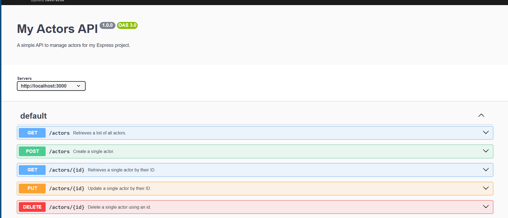

# API Validation and API Docs
## 1. Setup /films endpoints
- Continuing with the same project directory from LN01, I created **film.model.js, film.controller.js, film.route.js** for Film Model (for films table in database), controllers (to handle requests toward these endpoints) and routers (to receive requests and apply approriate controllers to handle them)
    ```js
    // models/film.model.js
    import { DataTypes } from "sequelize";
    import sequelize from "../configs/database.js";
    const Film = sequelize.define('Film',{
        // define properties according to attributes of films table
    }, {
        tableName: 'film',
        timestamps: false
    })

    export default Film;
    ```
    ```js
    // controllers/film.controller.js

    import { where } from "sequelize";
    import Film from "../models/film.model.js";

    export const getAllFilms = async (req, res) => {
        ...
    }

    export const getFilm = async (req, res) => {
        ...
    }

    export const postFilm = async (req, res) => {
        ...
    }

    export const putFilm = async (req, res) => {
        ...
    }

    export const deleteFilm = async (req, res) => {
        ...
    }
    ```
    ```js
    // routes/film.route.js

    import { Router } from "express";
    import { deleteFilm, getAllFilms, getFilm, postFilm, putFilm } from "../controllers/film.controller.js";

    const filmRoute = Router()
    filmRoute.get('/', getAllFilms)
    filmRoute.get('/:id', getFilm)
    filmRoute.post('/', postFilm)
    filmRoute.put('/:id', putFilm)
    filmRoute.delete('/:id', deleteFilm)
    export default filmRoute;
    ```

- Then, I integrated new router middleware for **films** endpoints into **index.js**
    ```js
    // index.js
    import express from "express";
    import sequelize from "./configs/database.js";
    import actorRoute from "./routes/actor.route.js";
    import filmRoute from "./routes/actor.route.js";
    import { configDotenv } from "dotenv";
    configDotenv()
    const app = express();
    app.use(express.json());
    const port = 3000;

    app.get('/', (req, res) => {
        res.send('MySQL + Express connected!');
    });

    app.use('/actors', actorRoute)
    const startServer = async () => {
        try {
            // console.log(sequelize.config)
            await sequelize.authenticate();
            console.log("DATABASE CONNECTED!!!")
            await sequelize.sync({force:false});
            app.listen(port, () => {
                console.log("Server running on port: " + port);
            })
        } catch (error) {
            console.log(error.stack)
        }
    }

    startServer();
    ```
## 2. Create HTTP Request to test new endpoints
- Created requests/film.request.http and prepared sample HTTP request for new API endpoints, covering GET, POST, PUT and DELETE methods
    ```js
    // requests/film.request.http

    GET http://localhost:3000/films
    ###
    GET http://localhost:3000/films/1
    ###
    POST http://localhost:3000/films
    Content-Type: application/json

    {
        "language_id": 1,
        "rental_duration": 2,
        "rental_rate": 4.99,
        "replacement_cost": 10.99
    }
    ###
    POST http://localhost:3000/films
    Content-Type: application/json

    {
        "title": "A new Film",
        "language_id": 1,
        "rental_duration": 2,
        "rental_rate": 4.99,
        "replacement_cost": 10.99
    }
    ###
    DELETE  http://localhost:3000/films/1
    ###
    PUT http://localhost:3000/films/2
    Content-Type: application/json

    {
        "title": "A new title",
        "language_id": 1,
        "rental_duration": 2,
        "rental_rate": 4.99,
        "replacement_cost": 10.99
    }
    ```

## 3. Install Joi and add API validation for films endpoints
- I installed  [Joi (data validation library for JS)](https://github.com/hapijs/joi) via npm install
    ```powershell
    npm install joi
    ```
- Inside film.controller.js, I created a schema (a Joi object that is used to validate JSON-format data) and used [Joi built-in validation functions](https://joi.dev/api/?v=17.13.3#introduction) to apply constraints for the properties, based on value constraints of films table. After defining that schema, I put it into action within POST and PUT controllers because these controllers handle more complex request bodies than others
    ```js
    // controllers/film.controller.js
    /*
        other imports
    */ 

    import Joi from "joi";
    const schema = Joi.object({
    title: Joi.string()
        .max(255)
        .required(),

    description: Joi.string()
        .allow(null, ''),
    release_year: Joi.number()
        .integer()
        .min(1888)
        .max(new Date().getFullYear()), 

    language_id: Joi.number()
        .integer()
        .positive()
        .required(),

    original_language_id: Joi.number()
        .integer()
        .positive()
        .allow(null),

    rental_duration: Joi.number()
        .integer()
        .positive()
        .required(),

    rental_rate: Joi.number()
        .precision(2) 
        .required(),

    length: Joi.number()
        .integer()
        .positive()
        .allow(null),

    replacement_cost: Joi.number()
        .precision(2)
        .required(),

    rating: Joi.string()
        .valid('G', 'PG', 'PG-13', 'R', 'NC-17')
        .default('G'),

    special_features: Joi.string()
        .allow(null, '')
    });

    /* 
        GET controllers
     */

    export const postFilm = async (req, res) => {
        /*
            ...
            Get request body "newFilm"
            ... 
        */
            const {value, error} = schema.validate(newFilm);
            console.log(value, error)
            if (error){
                res.status(400).send({msg: error?.details})
            }
        /*
            Handle the request after successful validation 
        */
    }

    export const putFilm = async (req, res) => {
         /*
            ...
            Get request body "film"
            ... 
        */
            const {value, error} = schema.validate(film);
            console.log(value, error)
            if (error){
                res.status(400).send({msg: error?.details})
            }
        /*
            Handle the request after successful validation 
        */
    }

    /*
        DELETE controllers
    */

    ```
## 4. Run the server, test the new API endpoints with their validator 
- I ran the server with this command
    ```pw
        npm run dev
    ```
- These are some sample HTTP requests and response from the server that I have tested:
    + Sucessful requests
    ```http
    <!-- Req -->
    GET http://localhost:3000/films/1
    <!-- Res -->
    HTTP/1.1 200 OK
    X-Powered-By: Express
    Content-Type: application/json; charset=utf-8
    Content-Length: 336
    ETag: W/"150-56etHHfEl/snjzifIhV4lumMw6E"
    Date: Sat, 25 Oct 2025 08:26:00 GMT
    Connection: close

    {
    "film_id": 1,
    "title": "ACADEMY DINOSAUR",
    "description": "A thrilling documentary...",
    "release_year": 2006,
    "language_id": 1,
    "original_language_id": null,
    "rental_duration": 6,
    "rental_rate": "0.99",
    "length": 86,
    "replacement_cost": "20.99",
    "rating": "PG",
    "special_features": "Deleted Scenes,Behind the Scenes",
    "last_update": "2025-10-25T06:24:24.000Z"
    }

    ```
    ```http
    <!-- Req -->
    POST http://localhost:3000/films
    Content-Type: application/json

    {
        "title": "A new Film",
        "language_id": 1,
        "rental_duration": 2,
        "rental_rate": 4.99,
        "replacement_cost": 10.99
    }
    <!-- Res -->
    HTTP/1.1 200 OK
    X-Powered-By: Express
    Content-Type: application/json; charset=utf-8
    Content-Length: 172
    ETag: W/"ac-myDcuC69zYech4JPyWoXjsC3Mwc"
    Date: Sat, 25 Oct 2025 08:26:35 GMT
    Connection: close

    {
    "rating": "G",
    "last_update": {
        "val": "CURRENT_TIMESTAMP"
    },
    "film_id": 1034,
    "title": "A new Film",
    "language_id": 1,
    "rental_duration": 2,
    "rental_rate": 4.99,
    "replacement_cost": 10.99
    }

    ```
    + Failed requests by validation
    ```http
    <!-- Req -->
    POST http://localhost:3000/films
    Content-Type: application/json

    {
        "language_id": 1,
        "rental_duration": 2,
        "rental_rate": 4.99,
        "replacement_cost": 10.99
    }
    <!-- Res -->
    HTTP/1.1 400 Bad Request
    X-Powered-By: Express
    Content-Type: application/json; charset=utf-8
    Content-Length: 126
    ETag: W/"7e-VSln7usODpYi5j4TKfpRmNAJDRc"
    Date: Sat, 25 Oct 2025 08:27:12 GMT
    Connection: close
    {
        "msg": [
            {
                "message": "\"title\" is required",
                "path": [
                    "title"
                ],
                "type": "any.required",
                "context": {
                    "label": "title",
                    "key": "title"
                }
            }
        ]
    }

    ```
## 5. Install swagger, openapi and prepare API Documentation
- I installed swagger-ui-express (UI to view API Documentation) and yamljs (a library to load YAML file configuration for loading OpenAPI document written in YAML). 
    ```
     npm install yamljs swagger-ui-express 
    ```
- Then I created openapi.yaml, where I documentated my API endpoints following this example from [Swagger Editor](https://editor.swagger.io/). This file is used by **swagger-ui-express** to load information and display them on Swagger UI
    ```yaml
    # openapi.yaml
    openapi: 3.0.0
    info:
    <!-- General info -->
        ...
    servers:
    - url: http://localhost:3000
    components: 
    <!-- Define schema of request bodies and response bodies of API endpoints -->
    schemas:
        schema-1:
            ...
        schema-2:
            ...
    <!-- From this part, I defined paths, methods, decription of request & response applied for them respectively -->
    paths:
        path-name:
            method-1:
                ...
            method-2:
                ...
    ```

- After that, I implemented Swagger UI at endpoint **localhost:3000/api-doc** inside **index.js**. Starting by loading openapi.yaml with yamljs, then I passed that configuration into swaggerUI using **setup()** and integrated Swagger UI using **serve()** from **swagger-ui-express**
    ```js

    import YAML from "yamljs";
    import {serve, setup} from "swagger-ui-express";
    const swaggerDoc = YAML.load('./openapi.yaml')
    // other Express server setups and configuration
    app.use('/api-doc', serve, setup(swaggerDoc))
    // other codes to start the server

    ```
## 6. Run the server and access Swagger UI
- After running the server with `npm run dev`, the server would response with this UI at `localhost:3000/api-doc`
 
